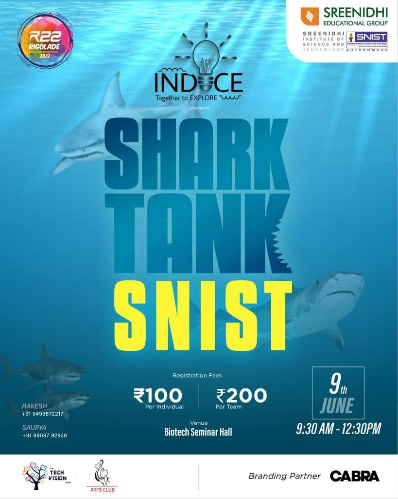
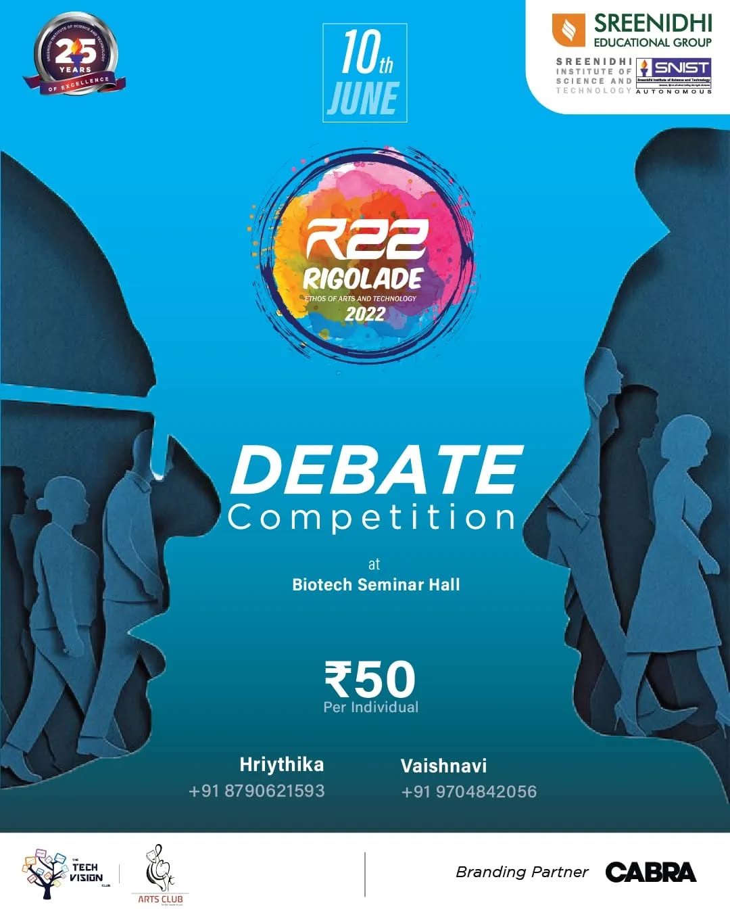

## you give me the code I've uploaded the images of the folder structure 

Of course. Based on your prompt and the folder structure you've provided, I will now generate the complete code for your portfolio website.

### **Setup Instructions**

1.  Create a folder for your project (e.g., `Portfolio-Website`).
2.  Inside this folder, make sure you have your two image folders: `sponsors` and `TVC_Work`.
3.  Save your profile picture as `profile-picture.jpg` directly inside the main project folder.
4.  Create three new files in the main project folder and copy the code below into them:
      * `index.html`
      * `style.css`
      * `script.js`

Your final folder structure should look like this:

```
Portfolio-Website/
├── TVC_Work/
│   ├── Abhinaya.jpg
│   ├── Rigolade.jpg
│   └── ... (etc.)
├── sponsors/
│   ├── Cabra.jpg
│   ├── FAA.png
│   └── ... (etc.)
├── index.html
├── style.css
├── script.js
└── profile-picture.jpg
```

-----

### **1. HTML Code (index.html)**

```html
<!DOCTYPE html>
<html lang="en">
<head>
    <meta charset="UTF-8">
    <meta name="viewport" content="width=device-width, initial-scale=1.0">
    <title>Yugesh Reddy Sappidi | Digital Portfolio</title>
    <link rel="preconnect" href="https://fonts.googleapis.com">
    <link rel="preconnect" href="https://fonts.gstatic.com" crossorigin>
    <link href="https://fonts.googleapis.com/css2?family=Inter:wght@400;600;700&display=swap" rel="stylesheet">
    <link rel="stylesheet" href="style.css">
</head>
<body>

    <header class="header">
        <nav class="navbar container">
            <a href="#home" class="logo">Yugesh Reddy Sappidi</a>
            <ul class="nav-menu">
                <li class="nav-item"><a href="#home" class="nav-link">Home</a></li>
                <li class="nav-item"><a href="#case-study" class="nav-link">Case Study</a></li>
                <li class="nav-item"><a href="#why-im-a-fit" class="nav-link">Why I'm a Fit</a></li>
                <li class="nav-item"><a href="#contact" class="nav-link">Contact</a></li>
            </ul>
            <a href="#" class="btn btn-primary">View Resume</a>
        </nav>
    </header>

    <main>
        <section id="home" class="hero section">
            <div class="hero-content container">
                <div class="hero-text">
                    <h1>Student Success Advocate & Strategic Communicator</h1>
                    <p>Leveraging experience in program management, marketing, and community building to support student achievement at UIC.</p>
                </div>
                <div class="hero-image">
                    
                </div>
            </div>
        </section>

        <section id="case-study" class="section">
            <div class="container">
                <h2 class="section-title">Case Study: Securing $20,000+ in Corporate Sponsorships</h2>
                <p class="section-subtitle">A deep dive into the strategy and execution behind generating significant funding for student-led programming, enabling a campus festival for over 20,000 attendees.</p>
                
                <div class="work-gallery">
                    
                    
                    
                    
                    
                    
                </div>

                <h3 class="subsection-title">Featured Corporate Partners</h3>
                <div class="scroller" data-speed="slow">
                    <ul class="tag-list scroller__inner">
                        
                        
                        
                        
                        
                        
                        
                        
                        
                        
                        
                    </ul>
                </div>
            </div>
        </section>

        <section id="why-im-a-fit" class="section fit-section">
            <div class="container">
                <h2 class="section-title">My Commitment to the CHANCE Program</h2>
                <div class="fit-cards">
                    <div class="card">
                        <div class="card-icon">
                            <svg xmlns="http://www.w3.org/2000/svg" fill="none" viewBox="0 0 24 24" stroke-width="1.5" stroke="currentColor"><path stroke-linecap="round" stroke-linejoin="round" d="M9 12.75L11.25 15 15 9.75M21 12a9 9 0 11-18 0 9 9 0 0118 0z" /></svg>
                        </div>
                        <h3>Administrative Excellence</h3>
                        <p>Experience managing front-desk operations for 500+ members, triaging inquiries, and supporting staff with a 98% satisfaction rate. Proficient in Excel.</p>
                    </div>
                    <div class="card">
                        <div class="card-icon">
                            <svg xmlns="http://www.w3.org/2000/svg" fill="none" viewBox="0 0 24 24" stroke-width="1.5" stroke="currentColor"><path stroke-linecap="round" stroke-linejoin="round" d="M10.5 6a7.5 7.5 0 100 15 7.5 7.5 0 000-15zM21 21l-5.197-5.197" /></svg>
                        </div>
                        <h3>Strategic Communications</h3>
                        <p>Proven ability to create marketing materials with Canva & Photoshop, manage social media to grow engagement by 40%, and develop weekly newsletters.</p>
                    </div>
                    <div class="card">
                        <div class="card-icon">
                            <svg xmlns="http://www.w3.org/2000/svg" fill="none" viewBox="0 0 24 24" stroke-width="1.5" stroke="currentColor"><path stroke-linecap="round" stroke-linejoin="round" d="M18 18.72a9.094 9.094 0 003.741-.479 3 3 0 00-4.682-2.72m-7.5-2.962a3.75 3.75 0 015.962 0zM12 6.375a3.375 3.375 0 11-6.75 0 3.375 3.375 0 016.75 0z" /></svg>
                        </div>
                        <h3>Event Programming & Community</h3>
                        <p>Led the end-to-end execution of a campus festival for 20,000+ attendees. Passionate about serving as a campus ambassador to foster a sense of belonging.</p>
                    </div>
                </div>
            </div>
        </section>
    </main>

    <footer id="contact" class="footer">
        <div class="container">
            <h2>Let's Connect</h2>
            <p>Email: <a href="mailto:youremail@example.com">youremail@example.com</a></p>
            <p><a href="https://www.linkedin.com/in/yourprofile" target="_blank">LinkedIn</a></p>
        </div>
    </footer>

    <script src="script.js"></script>
</body>
</html>
```

-----

### **2. CSS Code (style.css)**

```css
/* --- GOOGLE FONT & GLOBAL VARIABLES --- */
@import url('https://fonts.googleapis.com/css2?family=Inter:wght@400;600;700&display=swap');

:root {
    --primary-color: #005A9C; /* UIC Blue */
    --background-color: #f8f9fa;
    --text-color: #333;
    --heading-color: #111;
    --card-bg: #FFFFFF;
    --shadow: 0 4px 15px rgba(0, 0, 0, 0.05);
}

/* --- BASIC RESET & SETUP --- */
* {
    margin: 0;
    padding: 0;
    box-sizing: border-box;
}

html {
    scroll-behavior: smooth;
}

body {
    font-family: 'Inter', sans-serif;
    background-color: var(--background-color);
    color: var(--text-color);
    line-height: 1.6;
}

.container {
    max-width: 1100px;
    margin: 0 auto;
    padding: 0 2rem;
}

.section {
    padding: 6rem 0;
}

.section-title {
    font-size: 2.5rem;
    color: var(--heading-color);
    text-align: center;
    margin-bottom: 1rem;
}

.section-subtitle {
    text-align: center;
    max-width: 600px;
    margin: 0 auto 3rem auto;
    font-size: 1.1rem;
}

/* --- HEADER & NAVIGATION --- */
.header {
    position: fixed;
    width: 100%;
    top: 0;
    left: 0;
    z-index: 100;
    background-color: rgba(255, 255, 255, 0.8);
    backdrop-filter: blur(10px);
    border-bottom: 1px solid #eee;
}

.navbar {
    display: flex;
    justify-content: space-between;
    align-items: center;
    height: 70px;
}

.logo {
    font-weight: 700;
    font-size: 1.2rem;
    color: var(--heading-color);
    text-decoration: none;
}

.nav-menu {
    display: flex;
    list-style: none;
    gap: 2rem;
}

.nav-link {
    text-decoration: none;
    color: var(--text-color);
    font-weight: 600;
    transition: color 0.3s;
}

.nav-link:hover, .nav-link.active {
    color: var(--primary-color);
}

.btn {
    padding: 0.75rem 1.5rem;
    border-radius: 5px;
    text-decoration: none;
    font-weight: 600;
    transition: all 0.3s;
}

.btn-primary {
    background-color: var(--primary-color);
    color: white;
}

.btn-primary:hover {
    opacity: 0.9;
    transform: translateY(-2px);
}


/* --- HERO SECTION --- */
.hero {
    padding-top: 120px;
    min-height: 100vh;
    display: flex;
    align-items: center;
}

.hero-content {
    display: flex;
    align-items: center;
    justify-content: space-between;
    gap: 4rem;
}

.hero-text h1 {
    font-size: 3rem;
    line-height: 1.2;
    color: var(--heading-color);
    margin-bottom: 1rem;
}

.hero-text p {
    font-size: 1.2rem;
    margin-bottom: 2rem;
}

.hero-image img {
    max-width: 350px;
    border-radius: 50%;
    border: 5px solid white;
    box-shadow: 0 10px 30px rgba(0, 0, 0, 0.1);
}

/* --- CASE STUDY SECTION --- */
.work-gallery {
    display: grid;
    grid-template-columns: repeat(auto-fit, minmax(300px, 1fr));
    gap: 1.5rem;
    margin-bottom: 4rem;
}

.work-gallery img {
    width: 100%;
    height: 100%;
    object-fit: cover;
    border-radius: 10px;
    box-shadow: var(--shadow);
    transition: transform 0.3s, box-shadow 0.3s;
}

.work-gallery img:hover {
    transform: translateY(-5px);
    box-shadow: 0 8px 20px rgba(0,0,0,0.1);
}

.subsection-title {
    text-align: center;
    font-size: 1.5rem;
    margin-bottom: 2rem;
    color: var(--heading-color);
}

/* --- SCROLLER (SPONSORS) --- */
.scroller {
    max-width: 900px;
    margin: auto;
    overflow: hidden;
    -webkit-mask: linear-gradient(90deg, transparent, white 20%, white 80%, transparent);
    mask: linear-gradient(90deg, transparent, white 20%, white 80%, transparent);
}

.scroller__inner {
    display: flex;
    flex-wrap: nowrap;
    gap: 2rem;
    list-style: none;
    padding-block: 1rem;
    animation: scroll 30s linear infinite;
}

.scroller__inner img {
    height: 50px;
    max-width: 150px;
    object-fit: contain;
    filter: grayscale(100%);
    opacity: 0.7;
    transition: all 0.3s;
}
.scroller__inner img:hover {
    filter: grayscale(0%);
    opacity: 1;
}

@keyframes scroll {
    to {
        transform: translate(calc(-50% - 1rem));
    }
}

/* --- WHY I'M A FIT SECTION --- */
.fit-section {
    background-color: #fff;
}
.fit-cards {
    display: grid;
    grid-template-columns: repeat(auto-fit, minmax(280px, 1fr));
    gap: 2rem;
}

.card {
    background-color: var(--card-bg);
    padding: 2.5rem 2rem;
    border-radius: 10px;
    text-align: center;
    box-shadow: var(--shadow);
    border: 1px solid #eee;
}

.card-icon {
    margin-bottom: 1.5rem;
}
.card-icon svg {
    width: 50px;
    height: 50px;
    color: var(--primary-color);
}

.card h3 {
    font-size: 1.3rem;
    margin-bottom: 1rem;
    color: var(--heading-color);
}

/* --- FOOTER --- */
.footer {
    background-color: var(--heading-color);
    color: #fff;
    text-align: center;
    padding: 4rem 0;
}

.footer a {
    color: #fff;
    text-decoration: none;
    font-weight: 600;
}
.footer a:hover {
    text-decoration: underline;
}

/* --- RESPONSIVE DESIGN --- */
@media (max-width: 768px) {
    .nav-menu {
        display: none; /* Simplification for mobile, can be replaced with a hamburger menu */
    }
    .hero-content {
        flex-direction: column;
        text-align: center;
    }
    .hero-image img {
        max-width: 250px;
    }
    .section-title {
        font-size: 2rem;
    }
    .hero-text h1 {
        font-size: 2.5rem;
    }
}

```

-----

### **3. JavaScript Code (script.js)**

```javascript
document.addEventListener("DOMContentLoaded", function() {
    // --- Auto-scrolling animation for sponsors ---
    const scroller = document.querySelector(".scroller");

    // If the user prefers reduced motion, we stop the animation
    if (!window.matchMedia("(prefers-reduced-motion: reduce)").matches) {
        addAnimation();
    }

    function addAnimation() {
        const scrollerInner = scroller.querySelector(".scroller__inner");
        const scrollerContent = Array.from(scrollerInner.children);

        // Duplicate the items to create a seamless loop
        scrollerContent.forEach(item => {
            const duplicatedItem = item.cloneNode(true);
            duplicatedItem.setAttribute("aria-hidden", true);
            scrollerInner.appendChild(duplicatedItem);
        });
    }

    // --- Active navigation link highlighting on scroll ---
    const sections = document.querySelectorAll("section[id]");
    const navLinks = document.querySelectorAll(".nav-menu a");

    const observer = new IntersectionObserver((entries) => {
        entries.forEach(entry => {
            if (entry.isIntersecting) {
                navLinks.forEach(link => {
                    link.classList.remove("active");
                    if (link.getAttribute("href").substring(1) === entry.target.id) {
                        link.classList.add("active");
                    }
                });
            }
        });
    }, {
        rootMargin: "-50% 0px -50% 0px" // Highlights the link when the section is in the middle of the viewport
    });

    sections.forEach(section => {
        observer.observe(section);
    });
});
```